# GUÍA DE INSTALACIÓN Y CONFIGURACIÓN DEL MOODLE

## PASO 1: Instalación

---
Una vez estamos en el proceso de instalación solo queda configurar todo y seguir los pasos

---
Seleccionamos el idioma que querramos

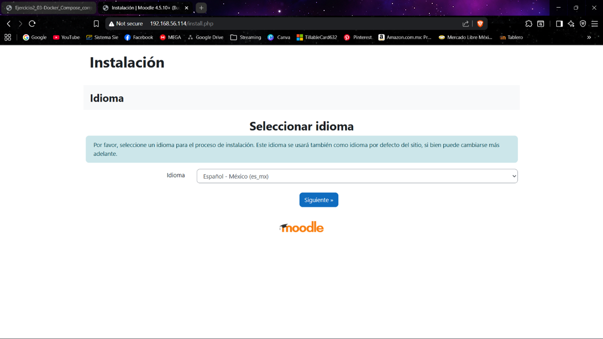

Y únicamente vemos la configuración que tendrá

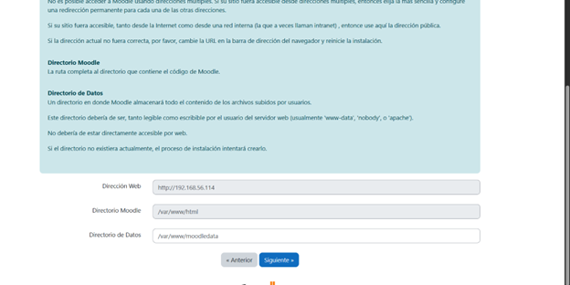

Colocamos los mismos datos que tenemos en nuestro archivo .env

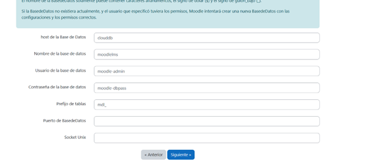

Y nos tendrá que salir el siguiente mensaje

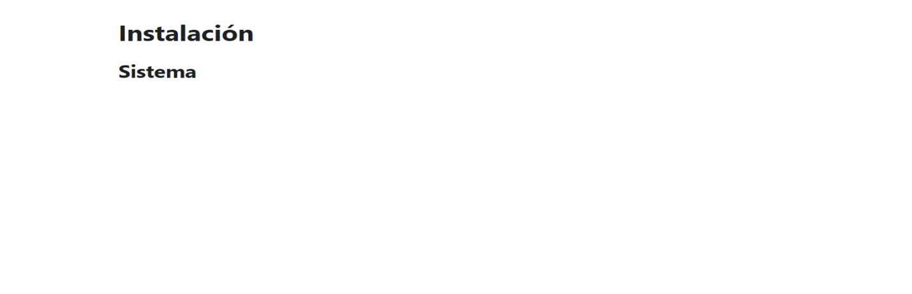

Esperamos a que se instalen todos los paquetes

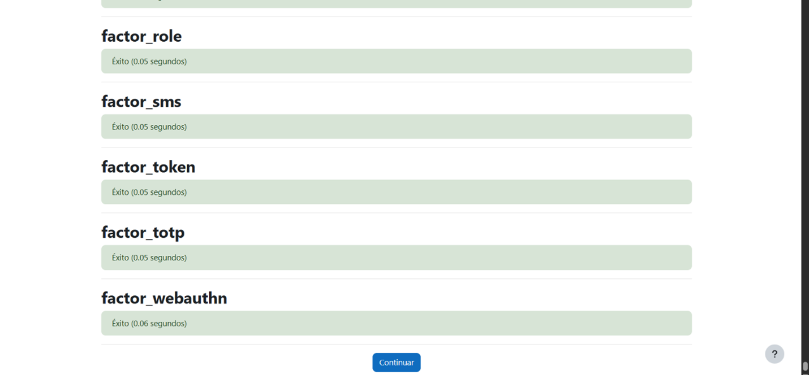

Lleanamos el formulario con nuestro usuario de administrador y credenciales

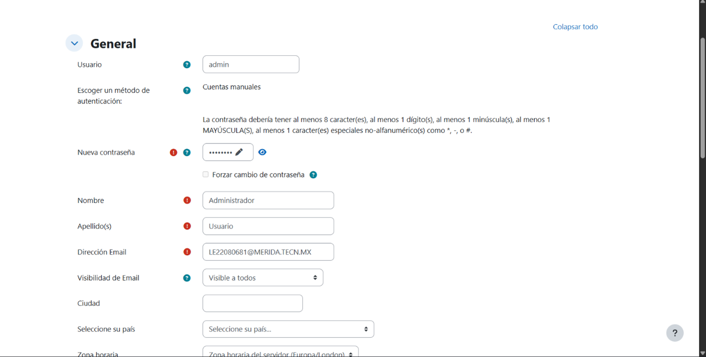

Y ya podremos acceder al MOODLE

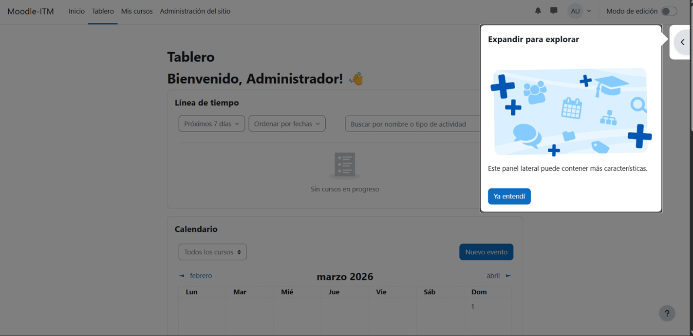

---
## PASO 2: Creación de un curso

primero iremos a la pestaña "Mis cursos" ahí es donde podremos crear uno, pero primero requerimos tener usuarios y roles para otorgar e inscribir al curso

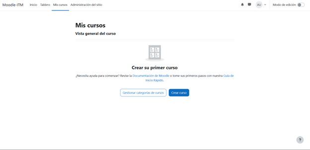

Entonces entramos a la configuración del MOODLE y entramos a la parte de usuarios y "Añadir un nuevo usuario"

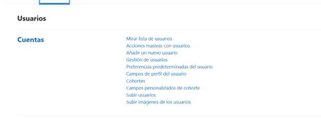

Le asignamos nombre y contraseña al usuaario y creamos tantos como necesitemos

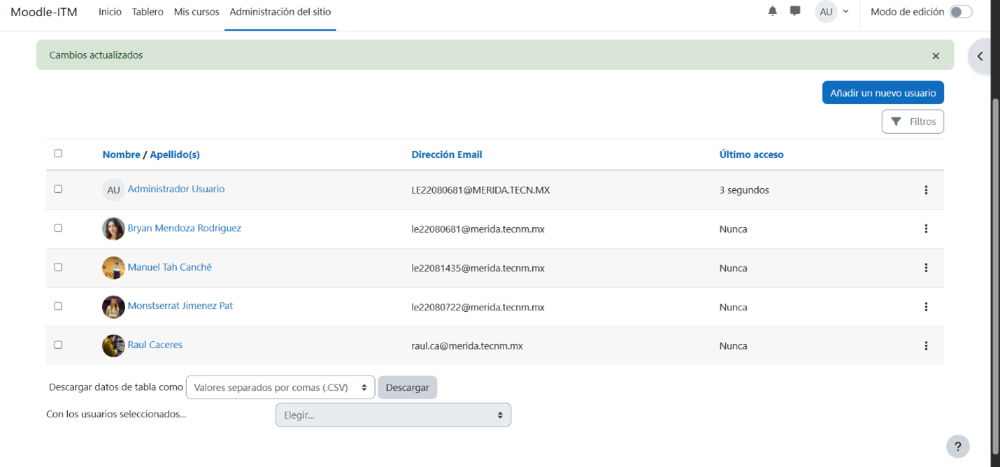

Ahoraa regresamos a la sección de cursos y creamos uno llenado los datos

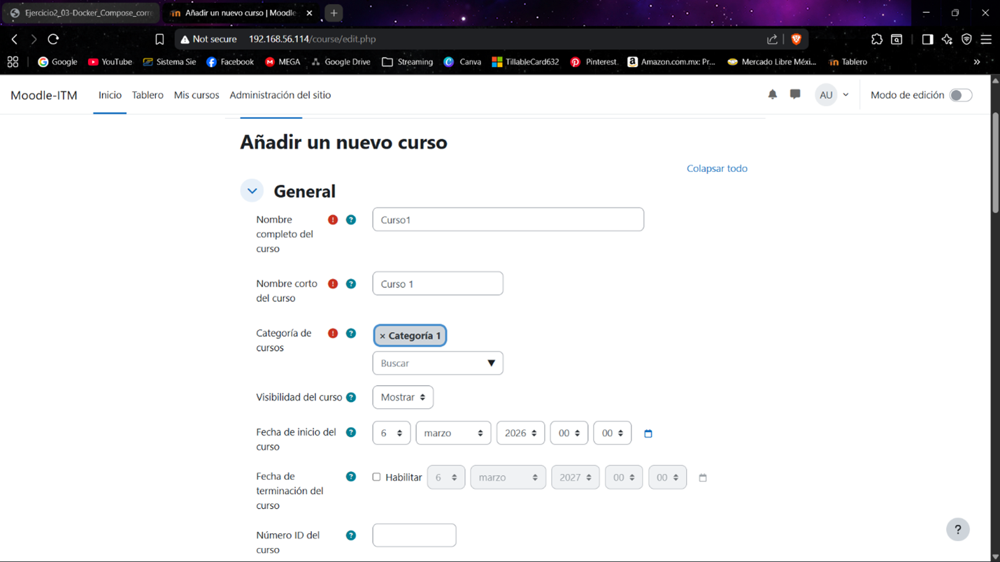

En la parte de inscripción podremos añadir a los usuarios y asignarles roles en el curso

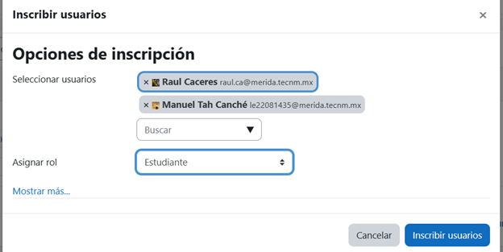

Finalmente podremos ver una lista de todos los usuarios del curso que agregamos

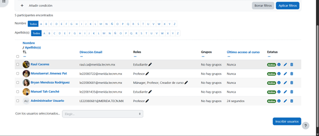
---